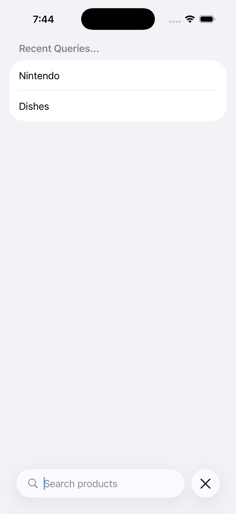
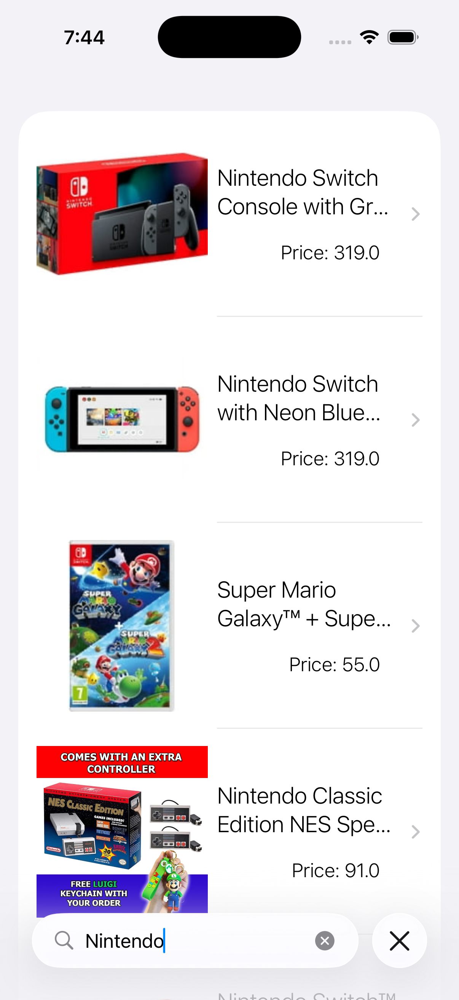

# eCommerce App

eCommerce app shows a list of products that are retrieved using search field.

### Setup
This project was implemented using XCode 26 and iOS 26 deployment target.

## Summary

#### -  APP DESIGN
Basic app design with list of items with a search field and detail view.
#### - SWIFTUI USE
We implemented the logic game using a lot features of SwiftUI language.

# App screens

<table style="width:100%">
  <tr>
    <td></th>
    <td></th>
  </tr>
</table>

### End